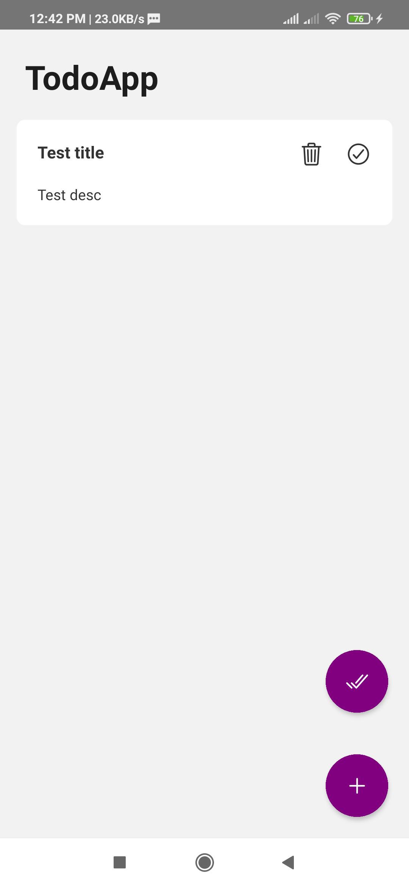
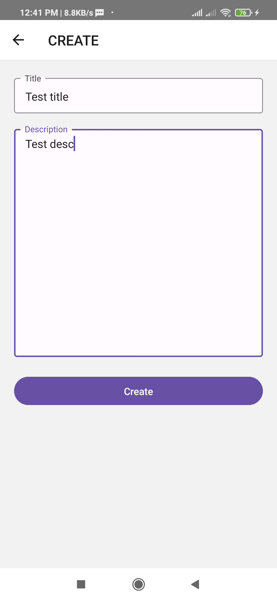
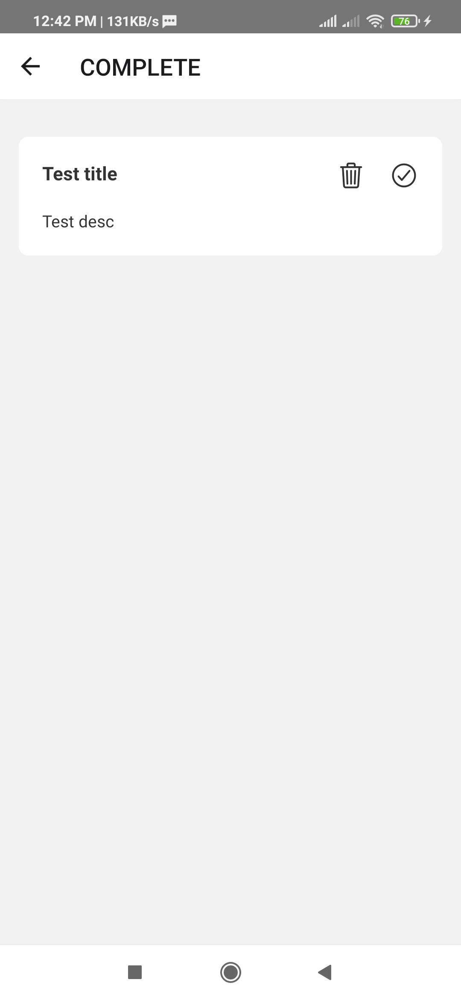
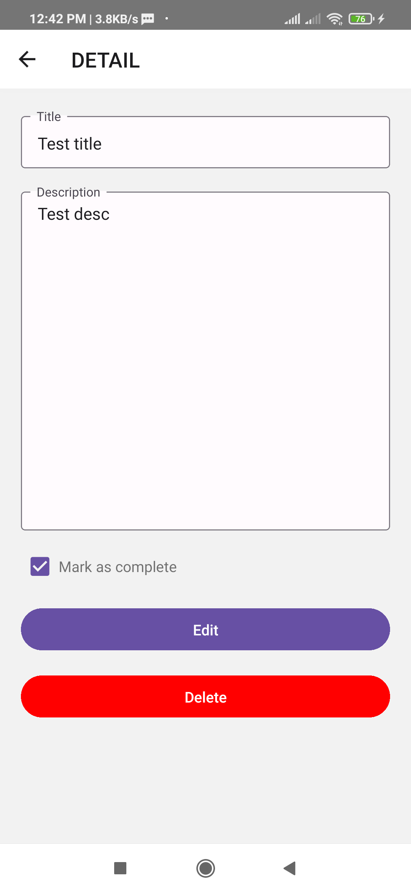

# React Native Todo List App

This **Todo List** application allow users to add, delete, edit, and complete task. In addition, the application also be able to store data locally.

<div style="display: flex; justify-content: space-between;">
    
    
    
    
</div>

## Start Metro Server

```bash
# using npm
npm start

# OR using Yarn
yarn start
```

## Start Application

```bash
# using npm
npm run android

# OR using Yarn
yarn android
```

## Start Testing

```bash
# using npm
npm run test

# OR using Yarn
yarn test
```

## Features App

- Show task lists
- Create new task
- Delete task
- Edit current task
- Mark task as complete / uncomplete
- Filtered data for complete / uncomplete task

## Folder structure

This template follows a very simple project structure:

- `__tests__`: Folder to store all unit testing functions or components.
- `src`: This folder is the main container of all the code inside your application.
  - `assets`: Asset folder to store all images, icons, vectors, etc.
  - `components`: Folder to store any common component that you use through your app
  - `pages`: Folder that contains all your application screens/features.
    - `Page`: Each screen should be stored inside its folder and inside it a file for its main component code, styles and function or logic related to the Page component.
      - `Page.tsx`
      - `Page.styles.ts`
      - `usePage.ts`
  - `redux`: Folder to store your action, reducer and store.
    - `actions`: This folder contains all actions that can be dispatched to redux.
    - `reducers`: This folder should have all your reducers
    - `store`: This folder to put redux store.
  - `routes`: Folder to store the navigation routes.
  - `utils`: Folder to store global utilities.
    - `constants.ts`: File to store any kind of constant that you have.
    - `type.ts`: File to store type value that you have.
  - `App.tsx`: Main component that starts your whole app.
  - `index.js`: Entry point of your application as per React-Native standards.

## Libraries

- [react-navigation](https://reactnavigation.org/) navigation library.
- [react-native-async-storage](https://github.com/react-native-async-storage/async-storage) key-value local storage system for React Native.
- [react-native-paper](https://github.com/callstack/react-native-paper) UI kit library.
- [react-native-toast-message](https://github.com/calintamas/react-native-toast-message) to show animated toast message component for React Native.
- [react-native-vector-icons](https://github.com/oblador/react-native-vector-icons) to show customizable icons for React Native.
- [react-redux](https://github.com/reduxjs/react-redux) for state management.
- [jest](https://facebook.github.io/jest/) and [react-native-testing-library](https://github.com/callstack/react-native-testing-library) for testing.